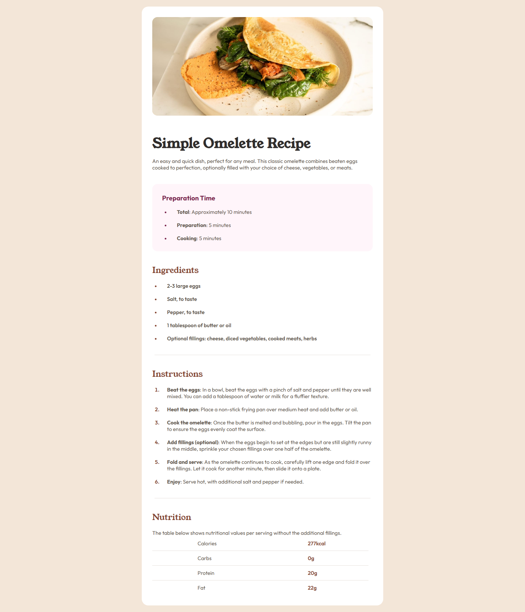
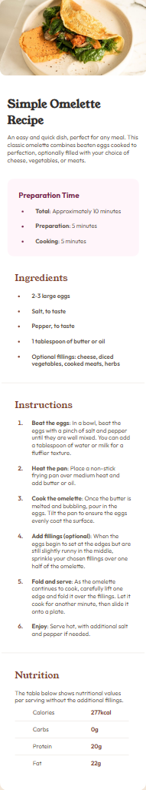

# Frontend Mentor - Recipe Page Solution

Esta é a minha solução para o desafio [Recipe page](https://www.frontendmentor.io/challenges/recipe-page-KiTsR8QQKm) do site Frontend Mentor. O objetivo era construir uma página de receita totalmente responsiva usando HTML e CSS.

## 🔗 Links

- [Desafio no Frontend Mentor](https://www.frontendmentor.io/challenges/recipe-page-KiTsR8QQKm)
- [Live site (GitHub Pages)](https://lucianonobrega.github.io/Frontend-Mentor-Recipe-Page/)
- [Repositório no GitHub](https://github.com/lucianonobrega/Frontend-Mentor-Recipe-Page)

## 🛠️ Tecnologias

- HTML5 semântico
- CSS3 com variáveis

## 📸 Screenshot

### Versão Desktop

### Versão Mobile

## 👨‍💻 Autor

- GitHub: https://github.com/lucianonobrega
- Frontend Mentor: https://www.frontendmentor.io/profile/lucianonobrega
